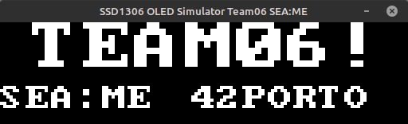
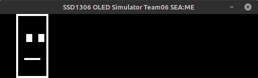
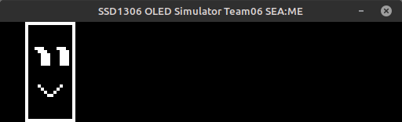
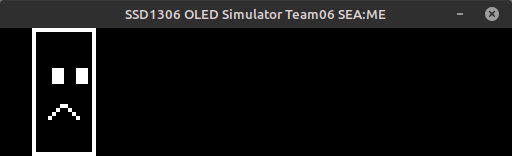
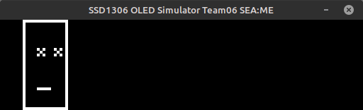

# Samples for SEA:ME Program

This repository contains sample implementations for OLED display programming, developed as part of the SEA:ME (Software Engineering Automotive & Mobility Ecosystems) program.

## Overview

These samples demonstrate how to work with SSD1306 OLED displays in both simulation and real hardware environments, providing educational resources for automotive software engineering students.

### Features

- 🖥️ SDL-based OLED display simulator
- 🔧 Real hardware implementation for SSD1306
- 📝 Custom font rendering system
- ✏️ Basic drawing primitives:
  - Lines
  - Rectangles (filled/unfilled)
  - Circles (filled/unfilled)
- 🔤 Text rendering with multiple scales

## Technical Details

The project includes implementations in both Python and C, showcasing different approaches:

### Python Implementation
- Pygame-based simulator
- Easy to use for prototyping
- Great for learning basic concepts

### C Implementation
- Low-level hardware control
- Direct I2C communication
- Optimized for embedded systems
- SDL-based simulation option

## Getting Started

### Prerequisites
For simulator:
```bash
# Python version
pip install pygame

# C version
sudo apt-get install libsdl2-dev
```

For real hardware:
```bash
# Python version
pip install smbus2

# C version
sudo apt-get install wiringpi
```

### Basic Usage

```c
// C example
Canvas* canvas = canvas_init();
canvas_text(canvas, 0, 0, "SEA:ME", 2);
canvas_circle(canvas, 64, 16, 10, true);
canvas_update(canvas);
```

```python
# Python example
display = SSD1306()
display.draw_text(0, 0, "SEA:ME", 2)
display.draw_circle(64, 16, 10, fill=True)
display.update()
```


## Educational Context

This project is part of the SEA:ME program, which focuses on:
- Automotive software engineering
- Embedded systems programming
- Real-time systems
- Human-Machine Interface (HMI) development

The samples are designed to help students understand:
- Display programming concepts
- Hardware communication protocols
- Graphics rendering algorithms
- Embedded systems optimization

## About SEA:ME

The Software Engineering Automotive & Mobility Ecosystems (SEA:ME) program is dedicated to training the next generation of automotive software engineers. It combines:
- Practical hands-on experience
- Industry-relevant projects
- Modern software engineering practices
- Automotive systems understanding


## Screens








